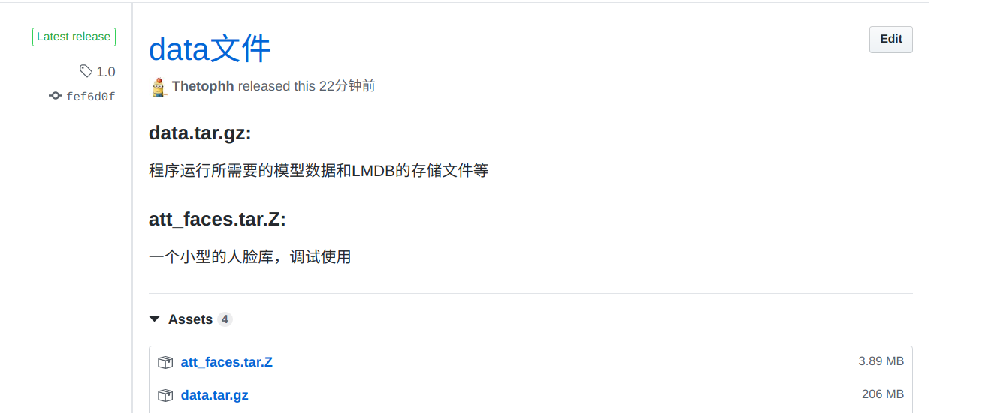
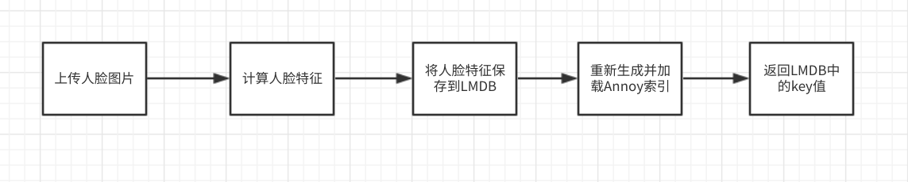
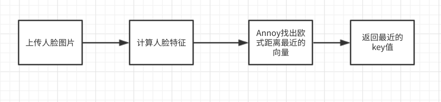

# 基于FaceNet的人脸识别系统

## #介绍

突发奇想，和同学一起做了一个用人脸识别来考勤的系统。使用流程大致是：学生先使用微信小程序上传人脸存入人脸库，考勤时教师端拍教室里学生的合照上传服务器，服务器端对照片进行切割，识别最终返回出勤的名单。

曾经试用过免费版的百度人脸识别API，但是它的qps限制实在是对使用体验影响太大，所以只好在别人项目的基础上封装了一个人脸识别的系统。测试过一个有5000人脸的人脸库，可以做到0.3秒返回识别的结果，还是比较实用的。

以下将从`安装过程`、`背景技术`、`主要功能`来介绍一下如何使用这个系统。

## 1 安装过程

### 1.1 下载源码

首先要clone源码，由于data文件夹太大，所以我把它打包放在release里面了

将data.tar.gz下载解压后，替换源码里的data文件夹

### 1.2 配置环境

系统使用docker镜像作为环境，所以直接拉取镜像就好

镜像：`registry.cn-hangzhou.aliyuncs.com/thetotp/facenet:3.0`

下载好镜像后，配置start.sh中的路径和镜像名等，使用`./start.sh`启动容器。

> （系统运行最少需要1G+的内存，2G内存的学生机压力较大，会出现程序退出的情况，可以通过添加交换空间来解决）

## 2 背景技术

### 2.1 FaceNet

FaceNet是整个系统的核心， 原理：

> 通过 CNN 将人脸映射到欧式空间的特征向量上，计算不同图片人脸特征的距离，由于相同个体的人脸的距离，总是小于不同个体的人脸，所以只需要计算人脸特征，然后计算距离使用阈值即可判定两张人脸照片是否属于相同的个体。

理论比较高深，可以把它当做有个黑盒：扔进去一个人的图片，会返回对应的特征向量（就是一个多维数组）。比较两张图片是否是同一个人，只需要比较两个图片的特征向量之间的欧几里得距离即可，小于一定的数值即可断定两张图片是同一个人。（本系统推荐0.6，可根据需要自行调节）

### 2.2 MTCNN

FaceNet在计算人脸特征时图片中其他元素越少，那么计算出的特征就越准确。所以使用FaceNet计算特征向量之前要对图片进行预处理。（要做的预处理很多，人脸切割是处理的第一步，其他处理FaceNet都有封装提供，不再介绍。）

MTCNN是一个识别效果和识别效率都比较好的人脸识别的算法，同样把它看做一个黑盒：扔进去一张照片，会返回这张照片中所有人脸的位置、特征点的位置等信息，利用这些信息可以对照片进行人脸切割和人脸对齐处理。

### 2.3 LMDB

> LMDB是基于Btree-based的高性能mmap key-value数据库，性能测试结果参考[levelDB, TokuDB, BDB等kv存储引擎性能对比](https://www.cnblogs.com/bonelee/p/6341350.html?utm_source=itdadao&utm_medium=referral)。是在BerkeleyDB的基础上改进来的，支持事务操作，支持多进程访问。只产生两个文件data.mdb与lock.mdb,简单复制，多处应用。 

LMDB在系统中用来存储人脸的特征向量，key只能是整数类型的，不能是字符串；value可以是字符串。

### 2.4 Annoy

> [Annoy](<https://github.com/spotify/annoy>)是一个带有Python绑定的C ++库，用于搜索空间中接近给定查询点的点。它还创建了大型只读的基于文件的数据结构，这些数据被映射到内存中，以便许多进程可以共享相同的数据。

在一个非常大的人脸库中，逐一比对人脸库中的向量与目标向量显然是不实用的。Annoy可以解决这个问题。

Annoy会将人脸库中的向量数据生成一个类似查找树的数据结构，当做查找时的索引，并保存到一个文件中。程序运行时这个文件会被加载到内存中，实现快速查找出库中与目标向量欧几里得距离最接近的向量。当有新的向量插入库中时，这个数据结构会重新生成并重新加载。

## 3 主要功能

### 3.1 人脸注册 

人脸注册功能实现向人脸库存入人脸特征向量并返回在LMDB中的key值，主要流程：

### 3.2 人脸识别

上传人脸图片，返回与之特征向量距离最近的key值，主要流程：

